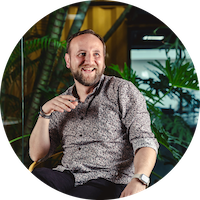
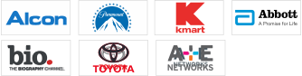
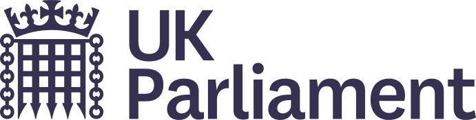

<link type="text/css" rel="stylesheet" href="assets/style.css" />
<blockquote id="strapline">
Head of Engineering — Digital Transformation Leader — Venture Builder
</blockquote>

#  Diego Moore

<diego@mibstar.co.uk> 📱[+447780866310](http://wa.me/+447780866310) 🔗 [LinkedIn](http://www.linkedin.com/in/diegomoore) 🌎 [mibstar.co.uk](http://www.mibstar.co.uk)📍W/Sussex, UK

<nav><strong>Jump to:</strong> <a href="#professional-experience">Professional Experience</a> ⤦ <a href="#skills">Skills</a> ⤦ <a href="#education">Education</a> ⤦ <a href="#awards">Awards</a> ⤦ </nav>

## Summary

Highly versatile Polymath Technologist with a strong background in building products in digital agencies since the dawn of the 2001 dotcom era. As a self-taught expert with a passion for technology and aesthetics, I excel in designing and delivering polished user experiences (UX) and leveraging my creative spark to drive innovative solutions.

At 13, I began building and selling PCs at school. Over the past 24+ years, I've honed my skills across multiple technology stacks (.NET, LAMP, Java, MACH) and platforms (Enterprise CMS, e-commerce, CRM, Mobile, IoT,
Cloud Native, etc.). My expertise extends to pre-sales, consulting, meticulous product road-maps, the vision through software architecture, and executing it all with strong team leadership.

**Key Strengths:**

* Strong expertise in software architecture and multiple technology stacks. Reviewing technical product options, solutions and reusable building blocks
* Product owner mindset including excellent UX design & aesthetics skills
* Proven ability to build, lead and manage teams, both in-house, remote, and offshore. Providing frameworks for career progression and mentorship
* Passionate about driving innovation and pushing the boundaries of technology
* Exposure to most industries: Publishing, Media, Telecoms, Entertainment, FinTech, Startups, Government, Pharma & Healthcare

## Professional Experience

### Founder & Principal Consultant 

**Mibstar Ventures** 📍 London ⏳ 2016 – Present

A boutique Technology Consultancy, Mibstar Ventures
My personal Venture Building vessel I've established to capture on-going collaborations in start- up capacity over the years some of which are stealth or incubation phase.

Previous projects below

### Director of Backend Development 

**Monks Technology Services** *(formerly Zemoga)* 📍  Bogotá / Remote ⏳ Sep 2019 – Jun 2024 

Returned to Zemoga (now Monks Technology Services) to re-establish the strength of the backend development practice. I was part of the pitch team for their largest opportunity in their then 17 year history, a ramp-up of 150 team members for Morningstar to nearshore their offshore dependency with China.

This coincided across the company with increased complexity in engineering projects and a particular focus in the FinTech sector and the associated due diligence and standards such as ISO certification requirements.

**Highlights & Accomplishments:**

* Growing the backend development team from 7 to 57 engineers in less than 3 years and all the associated processes and team structure to support the scale.
* In collaboration with my VP we established an additional DevOps Discipline and increased the awareness and skills across disciplines to respond to the demand of Serverless solutions and Native Cloud Engineers.
* Expanded the offering of skills beyond .Net, Java & PHP to include SalesForce, full-stack engineers, Python, data engineers and even clients in the Web3 / crypto space.

**Key Clients:** 

### Technical Director *(Interim CTO)* 

**Hello Daisy** *(via Mibstar)* 📍 London ⏳ Oct 2018 – Aug 2019

Having engaged previously on two occasions with Hello Daisy I was asked to come on board to cover for their CTO while an A series round was raised. My responsibilities included:

* Creating and presenting a detailed product road-map to investors Improvements to the prototype. Implementing feedback from customer trials
* A detailed specification including product concepts, UX, wire-frames, journeys, architectural technology stack and product backlog
* Validating the key building blocks of the stack with proof of concepts and hardware devices
* Establishing 3rd party partnerships for the production phase including hardware manufacturers in China

### Founder & Principal Consultant 

**Mibstar Ventures** 📍 London ⏳ Jun 2016 – Sep 2018

Having been empowered with my experience at Seth Godin’s AltMBA I pivoted Mibstar (formally Mibstar Technologies) to focus on Ventures where I’m able to apply my experience and passion for building digital products in start-up environments.

The variety of the ventures is indicative of the importance of spending time on projects I have an affinity towards. Some of them I’ve been able to help ship include:

* **Venture Building** – FinTechnovation incubators Providing Venture Builder & Consulting Services to a group 5 incubators from Surrey Incubation & The Surrey 100 Club. All under the auspices of the FinTechnovation Group. Due to NDA restrictions I can only disclose that these 5x incubators will provide Financial Services to professionals (including a peer-to-peer lending platform) alongside work based Financial Education using online platforms and video production services.

*  – Engaged with the charity ahead of building their first mobile app. My initial review led to recommending a project pause to reassess underlying assumptions. Facilitated workshops with the Digital Team, Directors, and International Team. Together, we mapped missing objectives and developed a concept supporting Digital as an additional channel to increase touch-points between sponsors, the charity, and sponsored children.

* **Diagri** – Internet of Things / Mobile Web App An Internet of Things (IoT) start-up providing smart monitoring solutions for livestock; tracking and detailing animal location and movement. I was brought in to support the founder and the 3rd party which had been building the prototype for the previous year without completion. Having developed a Product specification, associated road-map and Technology stack aligned to AWS best practices I was able to introduce and handover to the AWS Activate Start-up team to build a production version.

### Technical Director (Fractional) 

**The Unit** *(via Mibstar)* 📍 Brighton ⏳ 2015 – 2016

I was brought in to bolster the Technology team of this independent UX and Design agency, which was increasing their Financial Sector clients as well as expanding to larger and more complex projects.This required some insight and experience throughout from the pitch process all the way to implementation. Leading and expanding the relatively young team from front-end prototyping projects to full implementation of transactional e-commerce sites with associated integrations.

Establishing modern development practices, leveraging new tooling (Atlassian, AWS & fortrabbit), frameworks (Laravel & Drupal 8) and working collaboratively with client-side Architects (esure).

**Key Clients:** 

### Consultancy 

**Mibstar Technologies** 📍 London ⏳ Mar 2015 – Apr 2015

Working alongside a digital consultant as technical consultant supporting the newly appointed Chief Digital Officer of a FTSE-250 wholesaler that was undertaking a re-platform for Booker Group PLC.

I continue to provide support to several start-ups, with a focus in the shadow-banking sector and related FinTech industry where we’re currently in the final stages of a 2 years FCA accreditation process for our platform.

### Lead Technical Consultant 

**Precedent** 📍 London / Cardiff / Edinburgh ⏳ 2013 – 2015

End-to-end technical consultant working alongside other business strategy and UX consultants, during all phases of delivery of digital strategies for Precedent clients.

My involvement started early at the pitch process supporting new business as well as during discovery and definition phases. I worked to establish technical solutions through client stakeholder workshops in order to define the requirements and subsequent solution design.

Gathering input from technical analysts and platform leads, I established best practices within Precedent.

**Key Clients:** 

<h4>Reccomendation:</h4>

<blockquote>Diego is great to work with, he brings attention to detail and insights into his work from the experience has from working on so many projects. He is keen to bring people together and work as a team to deliver...   
I find Diego is hard-working and very keen. I can recommend him as he is great to work with.   
 
<strong>Hardip Bhamra</strong> — Managing Director (UK), Precedent</blockquote>

### Director of Technology 

**Zemoga** 📍 Bogotá / NY ⏳ Feb 2012 – Sep 2013

In addition to leading the App Development department I took responsibility over the Technology Operations team as well as being active within the Sales support structure previously carried out by the CTO.

Other areas of responsibilities included ownership of the hosting infrastructure (primarily Amazon), PBX systems connecting 3 sites and roll-out of various local infrastructure upgrades.

**Project Highlights:**

* **A+E International Television Networks** – New Drupal CMS Platform providing a common ‘core’ Global code-base baseline for all international joint ventures to build their digital properties (including [www.history.co.uk](http://www.history.co.uk) [www.biography.co.uk](http://www.biography.co.uk) [www.tuhistory.com](http://www.tuhistory.com) [www.seuhistory.com](http://www.seuhistory.com))

* **Abbott Laboratories** – iPad Salesforce app used by US sales force team across all franchises. This was developed natively in xCode with an asset management backend in Drupal, both of which integrate with their Federated Active Directory Single Sign-On (SAML) authentication.

* **Alcon (Novartis)** – Global iPad Salesforce app. A substantial upgrade and roll-out from US & Canadian based instance to a single Globalised multilingual app and backend, adding new functionality, international workflows to asset approval and more importantly to support the increase of the existing 600 end users to thousands of users globally.

**Key Clients:** 

<h4>Reccomendations:</h4>

<blockquote>A very difficult challenge is to find a senior technologist that can lead a team within a creative culture. If you see Diego for the first time you would think he's an artist, but behind his coolness lies technical genius...or technical creative genius I must say. I witnessed first hand how he successfully managed to deliver high quality projects during high stress circumstances for high level global brands. He proved effective integration with visual design and UI development distributed teams while manoeuvring ever changing client requirements...all without loosing sight of his integrity and leadership character.   

If you are looking for technical creative genius, I strongly suggest you don't waste the opportunity to have Diego on your team.  

<strong>Alejandro Gomez</strong> — Founder, Zemoga</blockquote> 

<blockquote>Diego was a joy to work with, helping illustrate complex technical problems in easy language and clear solutions   

<strong>Chris Altman</strong> — Director of International Digital Media - A+E Networks, NY</blockquote>

### Director Application Development 

**Zemoga** 📍 Bogotá / NY ⏳ May 2011 – Jan 2012

Lead a multi-disciplinary development team providing support for digital strategies primarily for a US clientele. Diverse projects from campaign specific sites like the NYC Marathon, bespoke Drupal development, several e-commerce launches, native iOS apps and working with TeamSite ECM on several projects.

Working closely with the US Sales Team on pitches and technical pre-sales support as well as closely off/on-site with clients.

**Key Clients:** 

<h4>Reccomendation:</h4>

<blockquote>Diego is the technologist that you want on your team. I've forever been impressed with his dedication, quick (and correct) decision making, dedication to his work and team. To manage development with very short to long timelines, you need someone with the high level of discipline and care that Diego brings to the table. He handles rapidly changing requirements with the level of agility that is required, yet is also keen on making sure that everything is well considered before moving forward.   
Of all the managers I've hired over the years, Diego will always be in the top of the list, and I enjoy watching him advance as time goes on.  
<strong>Dennis Portello</strong> — CTO, Zemoga</blockquote>

### Application & Systems Architect 

**UK Parliament** 📍 Westminster ⏳ 2010 – 2011

Joined a large in-house Applications & Development department which was running a £8m
Procedural Data programme to upgrade bespoke business critical systems which support both
Houses (the House of Commons and the House of Lords) with many ASPNet MVC, WPF and
underlying RESTFul Web Services.

One of the key objectives of this Procedural Data programme was to enrich data closer to the source in order to publish it in digital form in-line with cost saving exercise to reduce multi-million print contracts.

As such I was responsible for defining, presenting and getting approval of the Product & Solution options papers and their subsequent High Level Designs through the Enterprise Architecture Board. This included the data schema definitions for core data (People, Parliamentary Questions, Written Statements, etc) that would be published on [data.parliament.uk](http://data.parliament.uk)

<h2>2001 – 2010</h2>
Full CV can be found online:
<a href="http://diegomoore.github.io/CV">diegomoore.github.io/CV</a>

## 2001 – 2010

### Technical Director 

**EurekaStep** 📍 London ⏳ Apr 2006 – Mar 2010

Strengthened and developed a more in-depth technical service offering into this Digital Media Agency to compliment the growing and expanding client requirements. Leveraging in-house skills and near-shore partners using both off-the-shelf products and bespoke development depending on suitability.

**Key Clients:** 

#### Recomendation:
>  It's been a long hard slog, but sheer guts, determination and proven commercial results have helped Diego to become one of the greatest technical architect's in the business. He's an amazing visionary and I've lost count of the amount of times he's been pipped to the post on technical ideas he's been working on by the heady crew at either the BBC or Apple! For those who have money to invest wisely, he has a clarity of vision and sparkling understanding that would make even some of the great whites stand up and take notice.
>
> **Warren Wysocki** — Managing Director, EurekaStep

### Web Applications Developer (2003) > IT Manager (2004) 

**EurekaStep** 📍 Horsham ⏳ Aug 2003 – Mar 2006

Balanced inward facing responsibilities of Managing IT alongside the increasingly more important outward responsibilities to ensure the IT needs of clients and their projects were being met for web application projects.

**Key Clients:** 

#### Recomendation:
> When carrying delivery and commercial responsibility for blue chip client engagements, bleeding edge/emergent technologies are typically seen as being a high risk proposition. 
> 
> Having worked with Diego (2001-2008) on the successful sale and delivery of many ‘never been done before’ projects, as our Technical Director he carried a maturity and realism as to which technological boundaries should be pushed. 
> 
> Selling technology solutions to large scale established organisations where they would be seen as early adopters, or even the industry test cases, became the norm and that drive for innovation brought an exciting, highly rewarding (and often challenging) market differentiation to our business model. 
> 
> Having worked in a Tier 1 IT company for the last 3 years, I can see that Diego’s ideas and technologies are now viewed as foundational for the next generation ICT delivery model. Concepts such as Open Source, Cloud Computing, Software as a Service, Collaboration etc are being grasped for the cost savings that they can realise in a challenging economic environment, particularly by the Public Sector. 
> 
> I would highly recommend Diego as an innovator who will always be driven to be one step ahead of the market. The wise move is to invest in his ideas.
>
> **Iain McKay** — Chief Operating Officer (COO), EurekaStep

### Web Developer
**Digital Media & Motion** ⏳ Sep 2001 – Aug 2003

#### Recomendation:
> Diego is an extremely capable and dependable problem-solver and has wide-ranging experience in the delivery of technical solutions over the Internet.
> 
> **Dan White** — *Development Manager, Digital Media & Motion*

## Skills
### Languages
🇬🇧 **English** – Native / Professional 🇪🇸 **Spanish** – Native / Bilingual / Professional

### Hard skills:
* Software Development Life Cycle
* Large Scale Agile
* Lean / Agile 
* Architecture Definition (C4 Model)
* Technical Product Definition & Development
* Managed Capacity (Offshore / Nearshore)
* Compliance (ISO, PCI, SoX, HIPAA, etc)

**Tooling:**

* Multi Vendor Native Cloud Development
* Enterprise & Headless CMSs (Drupal /Sitecore / AEM / WordPress)
* Enterprise Integration Platforms (EIP)
* Salesforce, ERPs & Professional Services Automation (PSA)

**Real (soft) skills:**

* Leadership (5 Levels by John Maxwell)
* Distributed asynchronous collaboration
* Empathy & Self awareness
* Financial Literacy

## Education
* **The 21 Irrefutable Laws of Leadership, John Maxwell** — Year long effective leadership course, using real-life examples and insights gained from his decades of experience as a leadership coach.

* **Leadership Masterclass**, Hillsong London — A 7 week programme covering leadership excellence, high performance behaviours, developing leadership style & value proposition, excelling in teamwork and motivating others, communication skills developing personal confidence and building strong and effective relationships.

* **Seth Godin’s AltMBA**, 3rd cohort — A transformative leadership workshop focused on helping people navigate change and uncertainty.

* **A-Levels**: Design & Tech, Electronics, Spanish, Maths, ICT

## Awards
* **Finalist at Cannes** - As IT Manager for EurekaStep, my last involvement was a significant one – representing the company in a prestigious competition sponsored by the BBC and offered exclusively to its preferred supplier list on emerging Web 2.0 technologies.

* Built several hand-coded websites towards which I had began to work on before I had left college. One of the sites won an award from the South East England Development Agency (SEEDA)

[Back to Top ↑](#top)